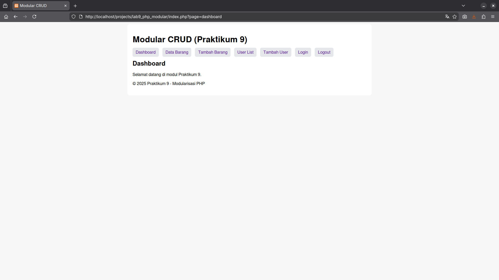
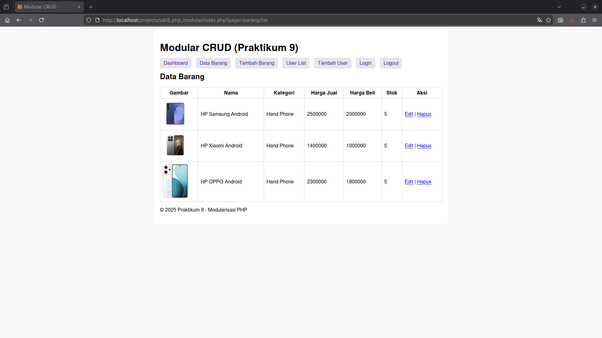
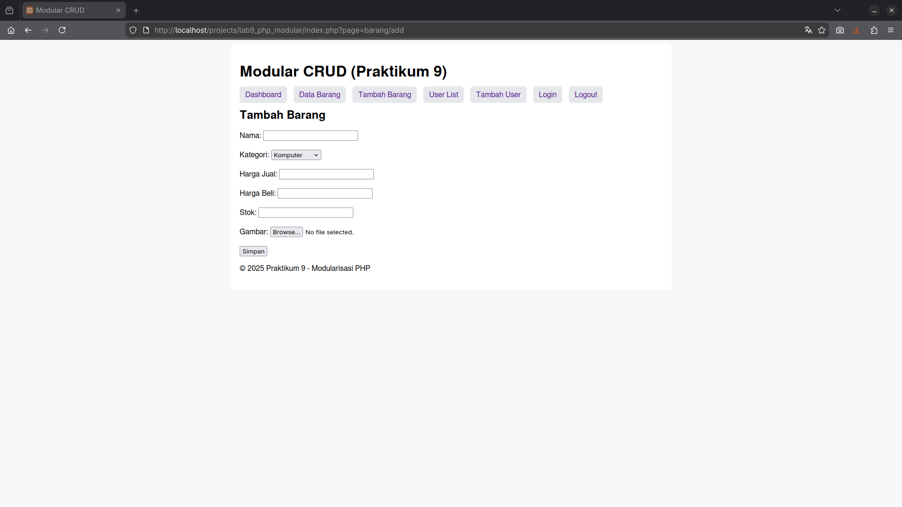
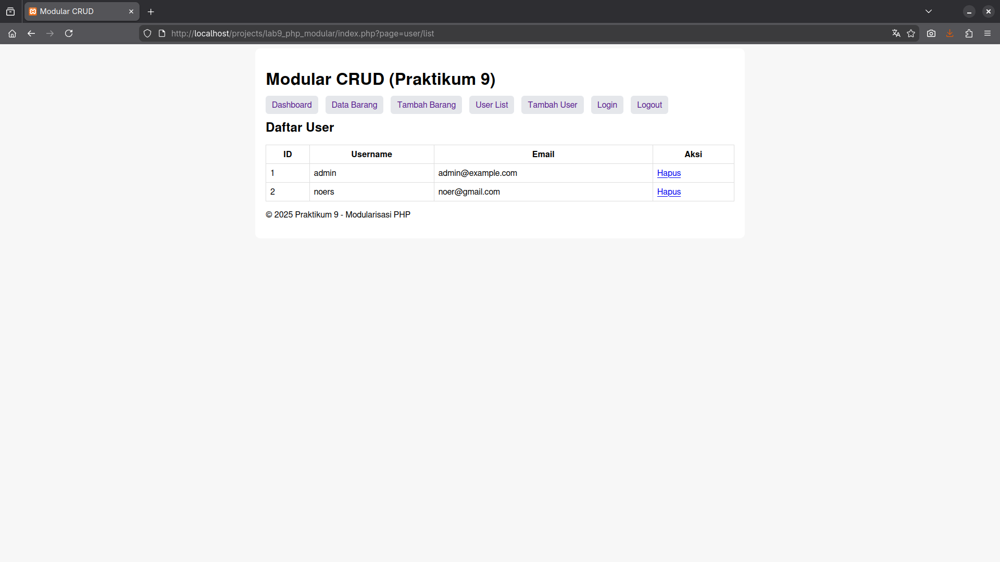
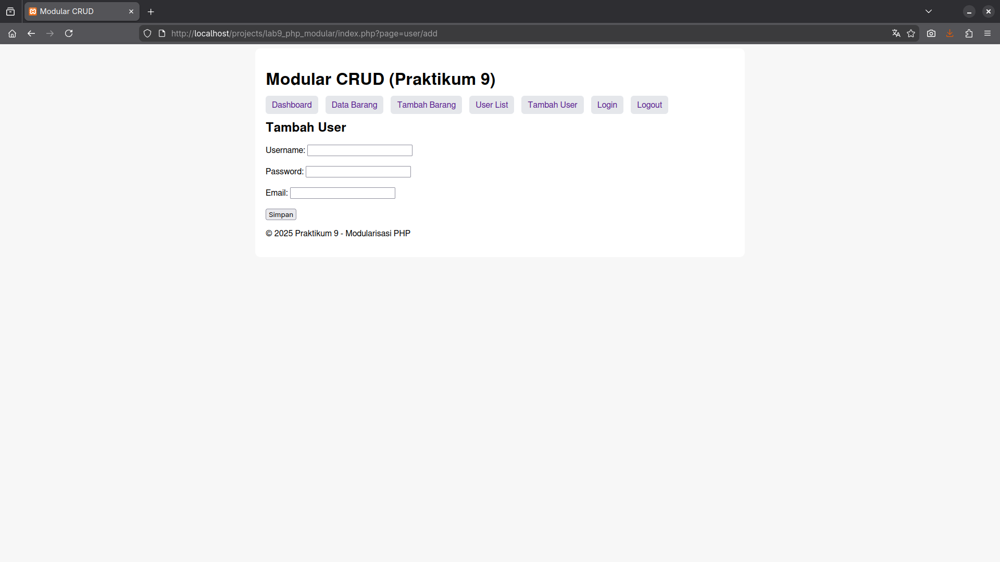
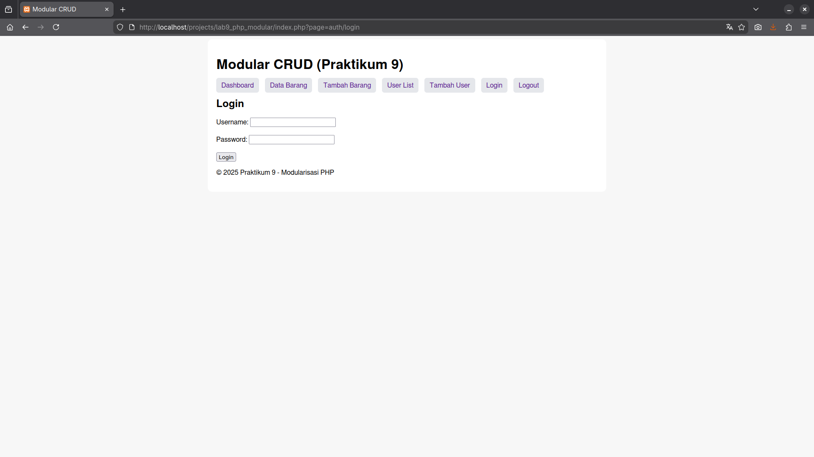

# Praktikum 9 — Modularisasi, Routing, dan Template PHP

Praktikum ini mengembangkan project CRUD dari praktikum 8 menjadi lebih **rapi, terstruktur, dan modular**, dengan menggunakan:
- Template header & footer
- Router sederhana (`index.php?page=...`)
- Modularisasi folder `modules/`
- Penambahan sistem Login & Session Protect

---

## Tujuan Praktikum
- Memecah kode menjadi beberapa modul
- Menggunakan template untuk konsistensi tampilan
- Menerapkan routing berbasis parameter URL
- Menerapkan sistem login sederhana
- Menata ulang struktur project menjadi lebih profesional

---

## Teknologi yang Digunakan
- PHP Native
- MySQL
- LAMPP/XAMPP (Apache)
- Routing Manual
- Session Management
- Template engine sederhana (header/footer)

---

## Sistem Login
Menggunakan tabel `users` dengan password hashing MD5 (sesuai materi).

### Default Login:
  user : admin
  password : admin123
---
# Cara Menjalankan 
1. clone repo
   ```bash
   git clone https://github.com/dnrprsty/Lab09Web
2. pindahkan ke :
   ```bash
   /opt/lampp/htdocs/
3. Import database (`data_barang` dan `users`)
4. Start Apache dan MySQL
   ```bash
   sudo /opt/lampp/lampp start
5. Jalankan Aplikasi
   ```bash
   http://localhost/lab9_php_modular
---
# Web Snapshot
## Home 

## List Barang 

## Tambah Barang 

## Daftar User 

## Tambah user 

## Login 


